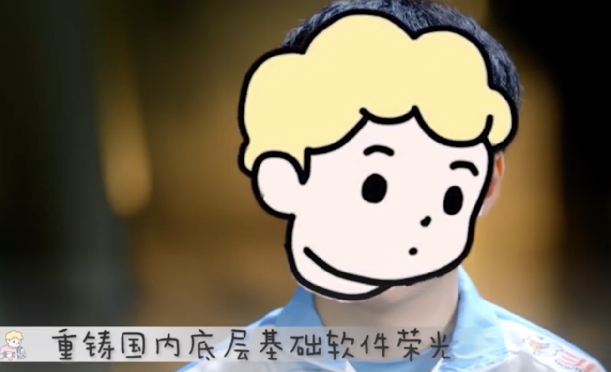

### 写在前面

其实只是一篇自说自话的流水账 -_-!

为啥今年突然想着要写年度流水账呢？因为我想了（逃）。好吧，其实是因为觉得今年对自己是比较特殊的一年（也可能是每一年其实都充满了特殊，只是自己感知生活的能力太弱了）

## 关于我的2021

### 生活

2月份的时候和高中同学们去了闸坡玩儿。和大家在一起，能回忆起阳光灿烂的日子。

  
  

3 4月份在家里远程办公。嗯......忙确实还是特别忙，但是确实也比较自由。希望以后也有机会能在家里一直远程工作。

  
  

和大伙在烧烤摊一边吃撸串一边看CBA总决赛，感觉很快乐

  
  

年中的时候打算减肥，在大佬舍友的鞭策下一度减到了70kg以下。但是暑假回家又反弹了......

  
  

暑假在严重内耗情绪下躺了几乎三个月

  
  

帮上初二的弟弟搬行李去学校，不禁感觉时间过得好快，高考毕业之后人生像摁了加速键一样。前阵子还刚和朋友吐槽过：

再附一下之前在知乎发过的一段想法。

> 今天中午在客厅里吃零食，奶奶在外面打完牌回来问我几点了（奶奶的手机只会用来接电话），是不是该煲汤了，我看了下手机说才两点半，奶奶非常欢喜地说：“居然还这么早，那我还能继续去打牌。”
>
> 突然想起自己小的时候，对时间也是没什么概念，经常感觉玩了好久跑回家一看才两三点，漫长的午后居然还没过去，然后会有种奇妙的幸福感。现在再也不会有这种感觉了，长大后几点该做什么都被安排得明明白白，即使能闲下来玩手机电脑，也是不知不觉就过去了几个小时。
>
> 对时间感知能力弱一点似乎也不是什么坏事。但与之相关的幸福感似乎在某个年龄之后就再也不会有了。

  
  

心血来潮尝试去烫了个头发，嗯......并不好看，似乎更秃了，和舍友讨论了下决定以后剃个光头（😭

  
  

在宿舍弄了几个小玩具

  
  

发现宿舍的天空有时候也挺好看

  
  

毕业设计选了几个写代码的课题但全被退了，老老实实干“老本行”烧垃圾去了......

  
  
   
 

### 技术 | 工作

年初在字节待了几个月，让我真正感受到了什么叫“字节和心脏只有一个能跳动”

长时间高强度工作不仅会让人脾气变坏，也会让人丧失对生活的感知能力（因为电脑一开一合，一天就过去了），个人技术成长更是无从谈起，因为根本没有多余的精力。所以，在字节的经历也让我下定了决心一定要去一个work life balance的公司，工作的终极目的是为了更好地生活，如果本末倒置了那就是很愚蠢的行为。但很遗憾的是，国内的大多数互联网公司，几乎完全不关心员工的身体健康和个人成长。将技术活干成了体力活，这跟我的理念是背道而驰的。

> dravenss说：
> 
> 有的读者可能会说我有一份 996 的工作，没有这么长的业余时间，那么我们应该利用一切业余时间满足技术的提升并换一个工作时间合理、不存在无意义加班的工作。
> 在长时间工作且没有业余时间提升自己的情况下，我们很难实现个人的成长和技术的进步，工程师需要在业余时间来提升自己的技术、了解更多的知识。在这个行业工作，
> 我们很难遇到完全不加班的工作，但是无意义的加班以及每天 12 小时的工作永远都是要拒绝的。

不过我还是很感激在字节的经历，因为这间接导致了我在后面的校招offer选择中作出一个目前看来还算正确的选择。

  
  

找到了想做的方向，也就是分布式存储。但自己之前做得太杂，而在存储方向的经验太少了，基础也不算好，所以开始恶补知识。花了一些时间重新学了比如local storage engine、consensus、体系结构等。但是越学越觉得自己懂得实在太少，陷入了深深的技术焦虑。

  
  

后面选offer的时候让我找回了当初高考填志愿那种患得患失的感觉，几乎是每半天脑子里就会有一个新想法，出国or留国？北or上or广or深？存储or计算？......  	后来有个前辈跟我说，其实很多时候如果我们肯退而求其次，就能过得很好，但大多数人往往都放不下那潜在但大概率不属于自己的所谓“前途”，让自己陷入各种困境。 让我有点茅塞顿开的感觉

最后听从了内心，选了个之前从没想过的去处。

(多谢鸭仔做的整活视频,笑哭)

  
  

雄心壮志买了数据库的五本经典大黑书，然后吃灰了（逃）

  
  

认真学了下一直很喜欢的Rust，把比较有名的几本书看了下，也参与了几个好玩的相关项目。希望以后在正式工作中写Rust。

### 总结

技术上没啥太大的进展，生活也是......

  
  
  

## 今年看了啥

### 看过的剧

- 《请回答1988》：神了。躲在被窝里看，怕哭鼻子被舍友发现-_-!，后劲也好足。
- 《切尔诺贝利》
- 《硅谷》：很多程序员的梗，比如 vim or emacs，哈哈
- 《以你的心诠释我的爱》
- 《是，首相》
- 《光阴的故事》：美中不足是找不到高清的版本
- 假面骑士faiz 亚极陀 空我 kabuto

### 今年在看的频道

- NiceChord：讲乐理相关
- Mommy Talk：科普天文、物理
- Linksphotograph：摄影、日本、vlog      狠狠满足了想去日本而不得的我（逃

### 看过的番

其实大多数都是重温...

- 《未闻花名》
- 《百变小樱》：初代萌王！
- 《火影忍者》：跳着看了
- 《刀剑神域 Alicization 篇》

### 看过的电影

其实也基本都是在重温...

- 《和莎莫的五百天》：高二时候班主任推荐过的，重温
- 《哈利波特》
- 《心灵奇旅》
- 《one day》
- 《无依之地》
- 《爱尔兰人》
- 《超脱》
- 《海边的曼彻斯特》
- ......

## 新一年的flag

在立新的flag之前，我觉得有必要review一下年初定的年度OKR以及完成度：

#### 技术

- [ ] ~~熟悉一门系统语言~~  30%
- [ ] ~~成为TiKV reviewer~~    这个事情从12月份才开始着手去做，虽然没完成，但考虑投入时间的话，进度还是挺满意的
- [x] 秋招去一个做存储的团队
- [x] ~~重学计算机基础课~~  50%
- [ ] ~~产出五篇自己满意的 数据库/存储 领域的博客~~  0%
- [x] ~~认真读完市面上consensus相关的论文并了解工程实现要点~~  40%

#### 生活

- [ ] ~~学会在深水区游泳~~  0%    逃
- [ ] ~~拍一个vlog~~   0%  逃
- [x] ~~无特殊情况，每周至少跑步两次~~     50%  有偷懒的时候,一半半吧-_-
- [x] 放假在家的时候自己做晚饭
- [ ] ~~每周打🏀一次~~ 0%
- [ ] ~~入门摄影~~  10%。看了点课，算10%？...

果然啊，flag就是flag......

虽然但是，2022年，新的flag也不能少

#### 技术

- [ ] 每个月至少阅读一篇 存储/分布式/数据库 领域的论文
- [ ] 深入研究local storage engine
- [ ] 深入研究两个文件系统
- [ ] C++达到 熟练 的水平

#### 生活

- [ ] 工作后养一只小猫咪
- [ ] 减肥到130斤
- [ ] 坚持每周健身3次
- [ ] 工作后每个星期都要尝试做一种没做过的菜

## 总结

新年快乐~